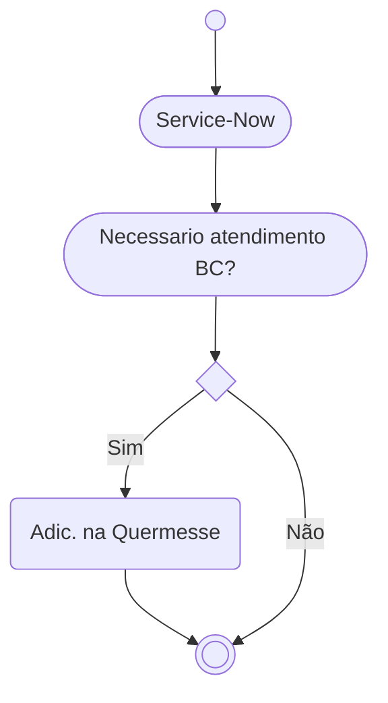
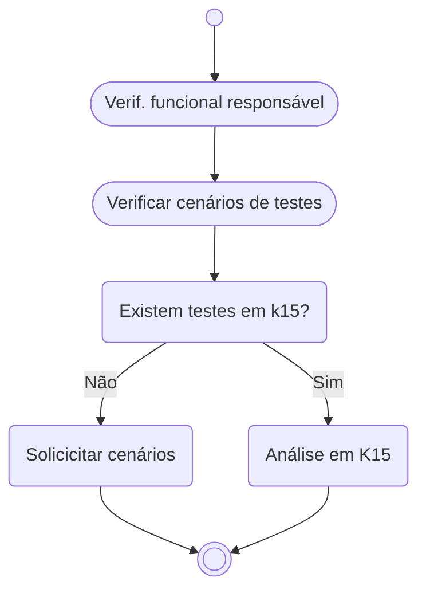
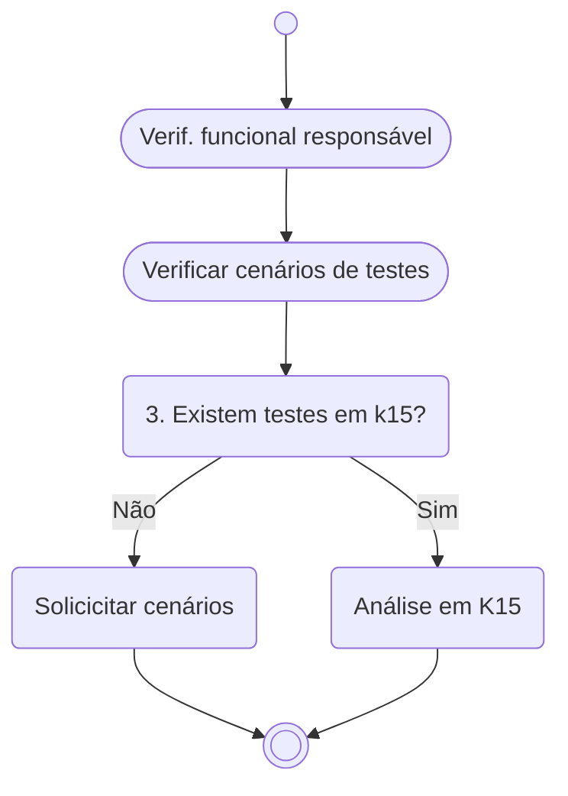

# Quermesse
 
 

Este tem como objeto explicar de maneira direta como são os fluxos e processo no atendimento de *incidentes* pelo time de `BC` da **EDP JUMP GA**.

## Glossário
É bem comum a utilização de sigla e aqui temos algumas para facilitar o entendimento dos processos/fluxos que são abordados para atendimentos de INC. A descrição abaixo é uma representação particular do cenário abordado e não contempla os termos de forma abrigida e/ou aplicada em outros cenarios/times/escopos.

| Sigla |Significado |Descrição |
|:--- |:---------- |:------------ |
|AST | - | Abreviação para centralizador de âmbito evoluitivo |
|BC|Business Consulting | ~~Find Clarity in Chaos~~ ABAP, Desenvolvedor SAP, Consultor ABAP, SAP DEV|
|FF | Firefighter | Perfil para acesso em Ambiente Produtivo com finalidades de análise e processamento |
|GA|Gestão de Ativos|-|
|INC|Incidentes| Abreviação para centralizador de âmbito corretivo |
|TCODE |Transação SAP | _Transaction code_ de forma abrevia |
|Service-Now |Sistema de serviços EDP | Sistema interno da EDP usado para gestão de ticket/chamados |
|.|.|.|

## O que é Quermesse?
Quermesse é um sistema criado e mantido pelo time de `BC` da **EDP JUMP GA** que tem como finalidade gerir os *Incidentes* que foram criados no sistema Service-Now e que exigem a atuação do time de `BC` para análises, melhorias e outros.

## Transação e filtro
Para acessar a solução deves user a tcode `ZCA_QUERMESSE_BC`. É possivel fazer filtro por Status, `BC`que esta atender, Tickets abertos e outros. Por padrão, o filtro inicial esta para que sejam listados os itens que não tem `BC` atribuido e que estão em aberto. Dessa forma tem de forma direto uma lista do que esta disponivel para atendimento no momento.

## Visão geral

Itens que foram criados no Service-Now para atendimento do time de Jump GA, podem ou não ser adicionados no sistema Quermesse. Isso depende se esse tema necessita de apoio tecnico, seja para analise ou pontos de correção. Apos analise do recurso funcional (que é responsavel por inserir o item na Quermesse), isso é definido.

### Visão de atendimento BC
A descrição contempla o fluxo dos passos que um `BC` deve atender para seguir a resolução de um INC na Quermesse. 

#### Boas praticas para seguir
Dentre as descrições do processo em si, algumas regras devem ser seguidas para que o fluxo ocorra como esperado durantes os atendimentos, segue abaixo:
- INC terá que estar inserido corretamente na Quermesse para se iniciar desenvolvimento/analise
- INC deve ser inserido na Quermesse pelo recurso funcional e atualizado pelo recurso `BC`
- O Status deve ser alterado de acordo com a evolução do INC
- O campo Resolução da Corretiva deve ser atualizado a medida que a solução se desenvolve (analise/testes/etc)

.

#### Mais um

Para facilitar o entendimento de cada Status na Quermesse, segue abaixo a lista com descrivos correspondentes.

| Status | Descrição | 
| :---------- | :---------- | 
| Criado | Item foi criado na Quermesse | 
| Atribuido | Quando o item esta direcionado para atendimento | 
| Em desenvolvimento (BC) | O item esta em atendimento pelo lado do `BC` | 

Em Teste (Funcional)
Aguardando Aprovação
Case SAP criado
Reaberto
Cancelado
Fechado

