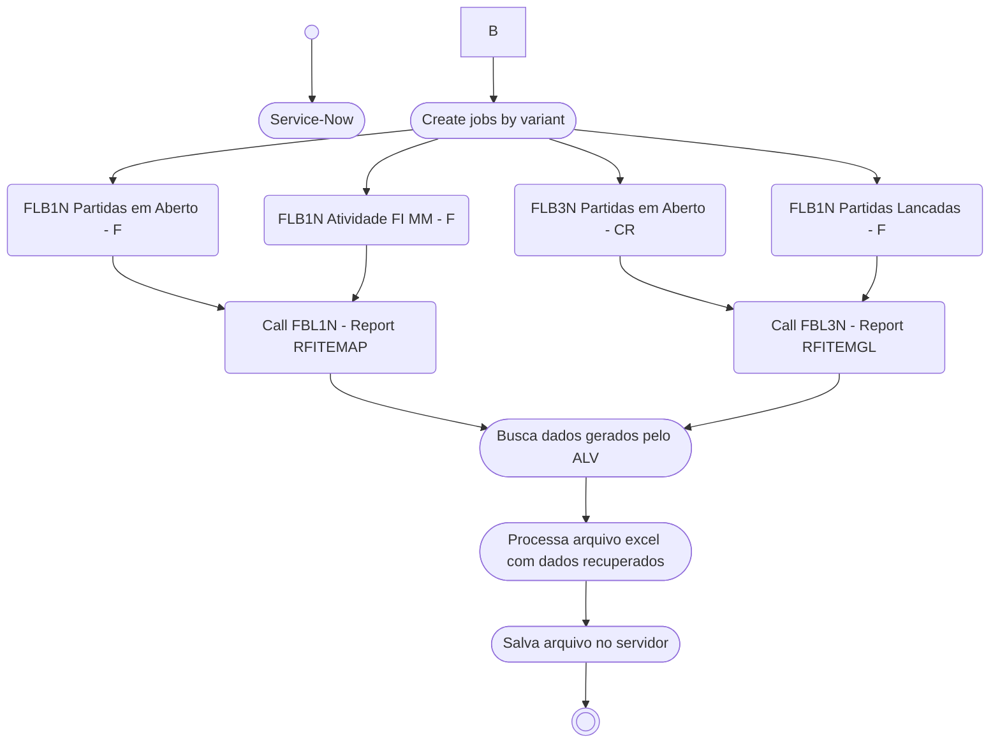

# Quermesse
 
 

Este tem como objeto explicar de maneira direta como são os fluxos e processo no atendimento de *incidentes* pelo time de `BC` da **EDP JUMP GA**.

## Glossário
É bem comum a utilização de sigla e aqui temos algumas para facilitar o entendimento dos processos/fluxos que são abordados para atendimentos de INC. A descrição abaixo é uma representação particular do cenário abordado e não contempla os termos de forma abrigida e/ou aplicada em outros cenarios/times/escopos.

| Sigla |Significado |Descrição |
|:--- |:---------- |:------------ |
|AST | - | Abreviação para centralizador de âmbito evoluitivo |
|BC|Business Consulting | ~~Find Clarity in Chaos~~ ABAP, Desenvolvedor SAP, Consultor ABAP, SAP DEV|
|GA|Gestão de Ativos|-|
|INC|Incidentes| Abreviação para centralizador de âmbito corretivo |
|TCODE |Transação SAP | _Transaction code_ de forma abrevia |
|Service-Now |Sistema de serviços EDP | Sistema interno da EDP usado para gestão de ticket/chamados |
|.|.|.|

## O que é Quermesse?
Quermesse é um sistema criado e mantido pelo time de `BC` da **EDP JUMP GA** que tem como finalidade gerir os *Incidentes* que foram criados no sistema Service-Now e que exigem a atuação do time de `BC` para análises, melhorias e outros.

## Transação e filtro
Para acessar a solução deves user a tcode `ZCA_QUERMESSE_BC`. É possivel fazer filtro por Status, `BC`que esta atender, Tickets abertos e outros. Por padrão, o filtro inicial esta para que sejam listados os itens que não tem `BC` atribuido e que estão em aberto. Dessa forma tem de forma direto uma lista do que esta disponivel para atendimento no momento.

## Visão geral

### Visão de atendimento BC
A descrição contempla o fluxo dos passos que um `BC` deve atender para seguir a resolução de um INC na Quermesse. 

#### Boas praticas para seguir
Dentre as descrições do processo em si, algumas regras devem ser seguidas para que o fluxo ocorra como esperado durantes os atendimentos, segue abaixo:
- INC terá que estar inserido corretamente na Quermesse para se iniciar desenvolvimento/analise
- O Status deve ser alterado de acordo com a evolução do INC