# Quermesse
 

> 🗘 Este documento, assim como o negócio, está em constante fase de melhoria e adaptação.

# Table of Contents
- [Introdução](#introdução) 
- [Glossário](#glossário)
- [O que é Quermesse?](#o-que-é-quermesse)
- [Transação e filtro](#transação-e-filtro)
- [Visão geral](#visão-geral)
  - [Visão de atendimento BC](#visão-de-atendimento-bc)
    - [Status de Incidentes](#status-de-incidentes)
    - [Boas praticas para seguir](#boas-praticas-para-seguir)
    - [Atividades iniciais](#atividades-iniciais)
  - [Fluxo de atendimento geral](#fluxo-de-atendimento-geral)

## Introdução
Este tem como objetivo explicar de maneira direta como são os fluxos e processo no atendimento de *Incidentes* pelo time de `BC` da **EDP JUMP GA**.

## Glossário
É bem comum a utilização de siglas e aqui temos algumas para facilitar o entendimento dos processos/fluxos que são abordados para atendimentos de INC. A descrição abaixo é uma representação particular do cenário abordado e não contempla os termos de forma abrangida e/ou aplicada em outros cenários / times / escopos.

| Sigla |Significado |Descrição |
| :--- |:---------- |:------------ |
| AST | Asset | Abreviação para centralizador de âmbito evolutivo |
| BC|Business Consulting | ~~Find Clarity in Chaos~~ ABAP, Desenvolvedor SAP, Consultor ABAP, SAP DEV|
| DFCT |Corrective Change | - |
| FF | Firefighter | Perfil para acesso em Ambiente Produtivo com finalidades de análise e processamento |
| GA|Gestão de Ativos|-|
| INC|Incidentes| Abreviação para centralizador de âmbito corretivo |
| TCODE |Transação SAP | _Transaction code_ de forma abrevia |
| Service-Now |Sistema de serviços EDP | Sistema interno da EDP usado para gestão de ticket/chamados |

## O que é Quermesse?
Quermesse é um sistema criado e mantido pelo time de `BC` da **EDP JUMP GA** que tem como finalidade gerir os *Incidentes* que foram criados no sistema Service-Now e que exigem a atuação do time de `BC` para análises, melhorias e outros.

## Transação e filtro
Para acessar a solução deves user a tcode `ZCA_QUERMESSE_BC`. É possível fazer filtro por Status, `BC`que esta atender, Tickets abertos e outros. Por padrão, o filtro inicial esta para que sejam listados os itens que não tem `BC` atribuído e que estão em aberto. Dessa forma tem de forma direta uma lista do que esta disponível para atendimento no momento.

## Visão geral
Itens que foram criados no Service-Now para atendimento do time de Jump GA, podem ou não ser adicionados no sistema Quermesse. Isso depende se esse tema necessita de apoio técnico, seja para analise ou pontos de correção. Após analise do recurso funcional (que é responsável por inserir o item na Quermesse), isso é definido.

### Boas praticas
Dentre as descrições do processo em si, algumas regras devem ser seguidas para que o fluxo ocorra como esperado durante os atendimentos, segue abaixo:
- INC terá que estar inserido corretamente na Quermesse para se iniciar desenvolvimento / análise
- INC deve ser inserido na Quermesse pelo recurso funcional e atualizado pelo recurso `BC`
- O Status deve ser alterado de acordo com a evolução do INC
- O campo Resolução da Corretiva deve ser atualizado a medida que a solução se desenvolve (analise/testes/etc)
- Após ter o ajuste transportado para _Ambiente de Produção_, o item deve ser fechado na Quermesse.

### Atividades iniciais
Afim de evitar retrabalho e também visando que o INC seja escalável, é necessário termos os dados de forma que o `BC` **consiga iniciar o atendimento de acordo com os dados que foram inseridos**. Ou no caso, pelo menos estar mais inteirado do que trata o fluxo para poder atender o INC.

```mermaid
flowchart TB
start((" "))    --> verifFuncional([Verif. funcional responsável])
verifFuncional  --> verifCenarios([Verificar cenários de testes])

    verifCenarios   --> existTestK15(Existem testes em k15?)
    existTestK15    --  Não --> solicitarK15(Solicitar cenários)

    solicitarK15    --> End
    existTestK15--  Sim --> avaliarK15(Análise em K15)

avaliarK15      --> End(((" ")))
```

> O atendimento do INC é inciado **somente após os dados de testes anexados** para chegarmos a soluções mais assertivas. A premissa de dados esta diretamente ligada a qualidade de entrega da solução.

Pode-se gerar um arquivo de testes respondendo por exemplo as perguntas abaixo:

0. Qual Ambiente?
1. Quais os passos de execução?
2. Qual o resultado encontrado hoje?
3. Qual o resultado esperado e como verificar?

Respondendo as perguntas acima, usando prints caso seja possível, consegue se gerar um arquivo de testes para que o `BC` avalie o cenário.

## Fluxo de atendimento por Status
Isso corresponde a uma representação direta de Status de Incidentes mantidos na Quermesse.

#### Status de Incidentes
Para facilitar o entendimento de cada Status na Quermesse, segue abaixo a lista com descritivos correspondentes.

| Status | Descrição | Observações | 
| :---------- | :---------- | :---------- | 
| Criado | Item foi criado na Quermesse | Esse passo será mantido ate dados de testes serem anexos/compartilhados | 
| Atribuído | Quando o item esta direcionado para atendimento | ∆ Atendimento ainda não iniciado |
| * Em desenvolvimento (BC) | O item esta em atendimento pelo lado do `BC` |  - | 
| * Em Teste (Funcional) | A solução proposta em testes funcionais |  - | 
| * Aguardando Aprovação | Aguardando aprovação do DFCT | Acontece após o sucesso dos testes funcionais | 
| ~~Case SAP criado~~ | ~~Solução sendo atendimento por _Case SAP_~~ |  
| Reaberto | Aberto novamente por necessidade de melhoria/ajuste | - | 
| Cancelado | Não há mais necessidade de ajuste ABAP | - | 
| Fechado | Concluído analise/ajuste | Ultima fase do INC | 

*_Itens que devem ser criados. Ainda não existentes no cenário atual_;  

### Diagrama de fluxo

```mermaid
flowchart TD
    start((" ")) --> Q1
    Q1(1. Criado) --> Q2(2. Atribuído)
    Q2 --> Desenvolvimento-BC
    Desenvolvimento-BC(6. Em desenvolvimento - BC) --> Q4(7. Em Teste - Funcional)

%%  saida de cancelamento
    Q4 --> Q3(3. Cancelado)
    Q3 --> End(((" ")))

    Q4 --> QQ{{Testes ok?}}
    QQ -- Sim --> Q5(8. Aguardando Aprovação)
    QQ -- Não --> Desenvolvimento-BC
%%  Desenvolvimento-BC --> Q6(Case SAP criado)
%%  Q6 --> Q4
    Q5 --> Q9(4. Fechado)
    Q9 --> End(((" ")))
```

🧮
