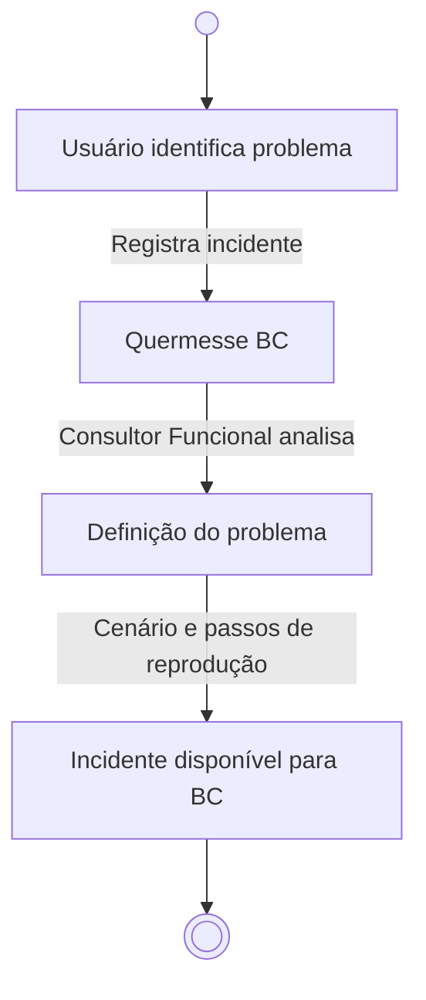
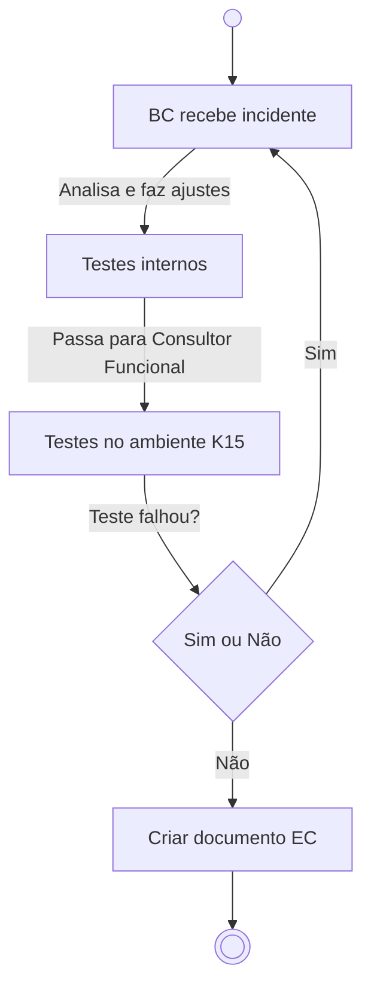
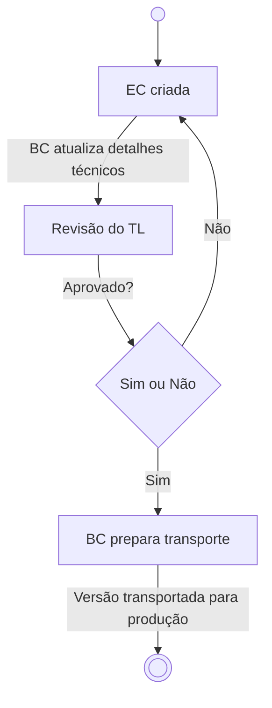

# Documentação do Processo de Correção ABAP

## 📌 Menu

- [1. Regras Gerais](#1-regras-gerais)
- [2. Fluxo de Trabalho](#2-fluxo-de-trabalho)
  - [2.1 Abertura de Incidente](#21-abertura-de-incidente)
  - [2.2 Atendimento pelo BC](#22-atendimento-pelo-bc)
  - [2.3 Transporte para Produção](#23-transporte-para-producao)
- [3. Glossário](#3-glossario)

---

## 1. 📜 Regras Gerais

- 🔗 Todas as atividades corretivas devem estar ligadas a um **incidente/ticket**.
- 🖥️ O sistema usado para análise e desenvolvimento ABAP é o **Quermesse**.
- 📝 O incidente deve ser registrado na **transação ZCA\_QUERMESSE\_BC - Quermesse BC**.
- 📌 O registro deve conter:
  - 🛠️ **Cenário atual**
  - 🎯 **Cenário esperado**
  - 📂 **Passos de reprodução**
- 🚫 O **BC (Business Consultant)** só deve atender incidentes devidamente registrados na Quermesse, garantindo rastreabilidade e priorização adequada.
- 📊 O **líder do time de corretiva** define a ordem de atendimento.
- ⚙️ O **algoritmo da Quermesse** prioriza os incidentes com base em **urgência e tempo de abertura**.
- 💬 A comunicação ocorre da seguinte forma:
  - 🔄 **BC ↔ Consultor Funcional** → via Microsoft Teams.
  - 📡 **Consultor Funcional ↔ Usuário** → via **Service-Now**.
- ✅ A mudança deve ser **aprovada pelo Tech Lead (TL)** antes de ir para produção.

---

## 2. Fluxo de Trabalho

### 2.1 Abertura de Incidente

### 2.2 Atendimento pelo BC

### 2.3 Transporte para Produção

---

## 3. Glossário

| Sigla                  | Significado                     | Descrição                                                               |
| ---------------------- | ------------------------------- | ----------------------------------------------------------------------- |
| **BC**                 | Business Consultant             | Responsável pela análise e desenvolvimento técnico ABAP                 |
| **EC**                 | Especificação de Correção       | Documento contendo detalhes técnicos da solução                         |
| **INC**                | Incidente                       | Registro de problema identificado no sistema                            |
| **K15**                | Ambiente de Qualidade           | Utilizado para testes de homologação                                    |
| **Quermesse**          | Sistema de Gestão de Incidentes | Plataforma utilizada para registrar e gerenciar correções ABAP          |
| **Service-Now**        | Sistema de Gestão de Chamados   | Ferramenta utilizada para interação entre consultor funcional e usuário |
| **TL**                 | Tech Lead                       | Responsável pela aprovação das correções antes do transporte            |
| **ZCA\_QUERMESSE\_BC** | Transação SAP                   | Código para acessar o sistema Quermesse                                 |

---

📌 *Mantenha esta documentação sempre atualizada conforme novas regras e processos forem definidos.*

