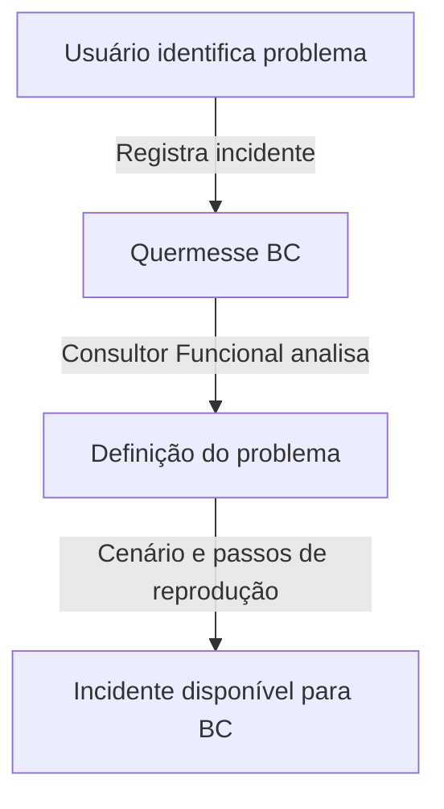
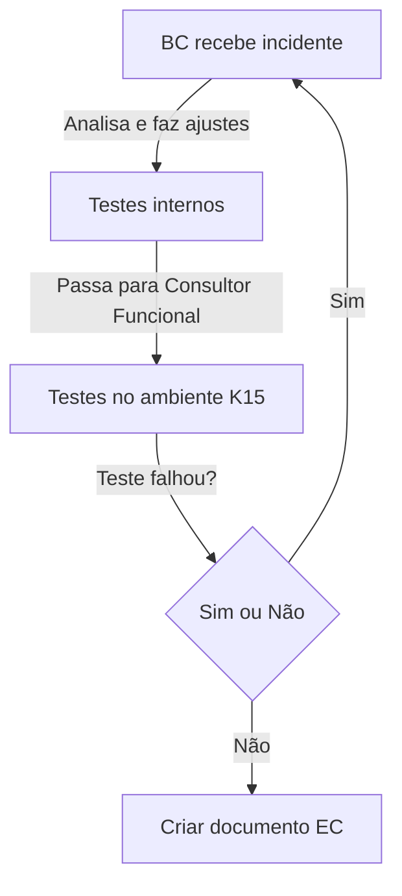
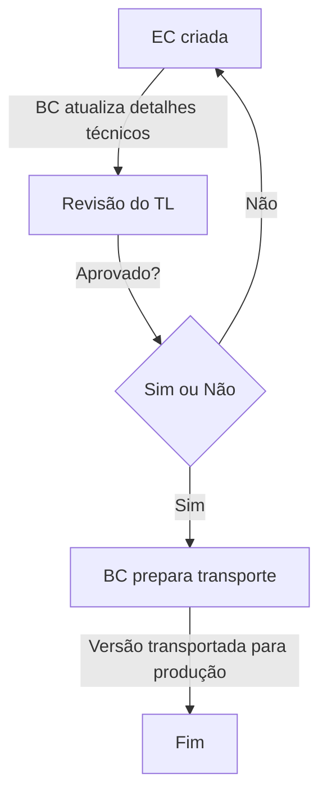

# Documentação do Processo de Correção ABAP

## 📌 Menu
- [1. Regras Gerais](#1-regras-gerais)
- [2. Fluxo de Trabalho](#2-fluxo-de-trabalho)
  - [2.1 Abertura de Incidente](#21-abertura-de-incidente)
  - [2.2 Atendimento pelo BC](#22-atendimento-pelo-bc)
  - [2.3 Transporte para Produção](#23-transporte-para-produção)
- [3. Glossário](#3-glossario)

---

## 1. Regras Gerais
- Todas as atividades corretivas devem estar ligadas a um **incidente/ticket**.
- O sistema usado para análise e desenvolvimento ABAP é o **Quermesse**.
- O incidente deve ser registrado na **transação ZCA_QUERMESSE_BC - Quermesse BC**.
- O registro deve conter:
  - **Cenário atual**
  - **Cenário esperado**
  - **Passos de reprodução**
- O **BC (Business Consultant)** não deve atender incidentes que não estejam registrados na Quermesse.
- O **líder do time de corretiva** define a ordem de atendimento.
- O **algoritmo da Quermesse** prioriza os incidentes com base em **urgência e tempo de abertura**.
- A comunicação ocorre da seguinte forma:
  - **BC ↔ Consultor Funcional** → via Microsoft Teams.
  - **Consultor Funcional ↔ Usuário** → via **Service-Now**.
- A mudança deve ser **aprovada pelo Tech Lead (TL)** antes de ir para produção.
- O ambiente de **homologação é o K15**.

---

## 2. Fluxo de Trabalho
### 2.1 Abertura de Incidente

### 2.2 Atendimento pelo BC

### 2.3 Transporte para Produção

---

## 3. Glossário

| Sigla | Significado | Descrição |
|-------|------------|-----------|
| **AST** | Asset | Centralizador de âmbito evolutivo |
| **BC** | Business Consultant | Consultor ABAP, Desenvolvedor SAP |
| **DFCT** | Corrective Change | Mudanças corretivas aplicadas a um incidente já em andamento |
| **FF** | Firefighter | Perfil para acesso ao Ambiente Produtivo |
| **GA** | Gestão de Ativos | Área responsável pela gestão de ativos na EDP |
| **INC** | Incidentes | Centralizador de âmbito corretivo |
| **TCODE** | Transação SAP | Código de transação no SAP |
| **Service-Now** | Sistema de serviços EDP | Sistema interno usado para gestão de tickets/chamados |

---

📌 *Mantenha esta documentação sempre atualizada conforme novas regras e processos forem definidos.*

