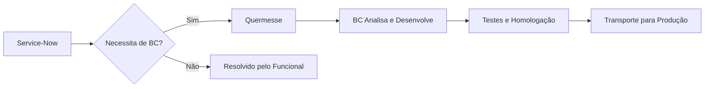
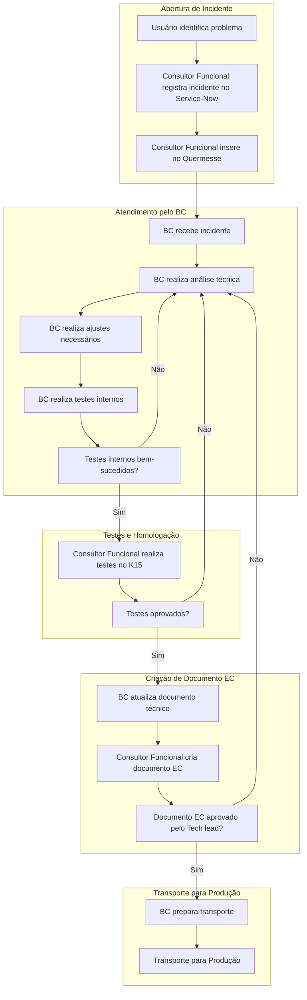
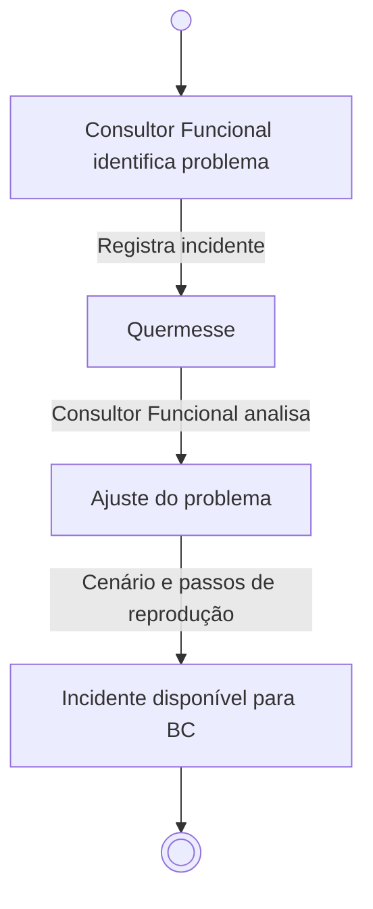
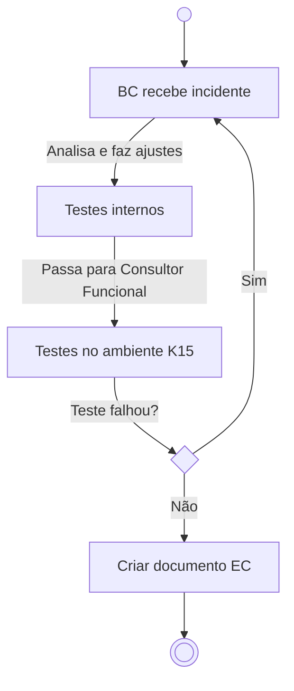
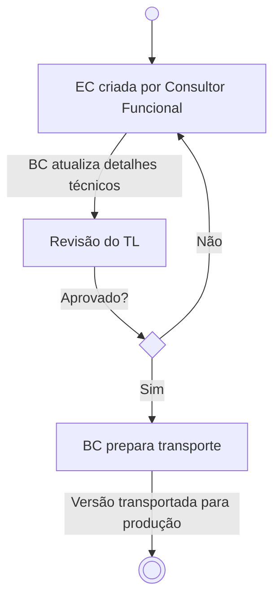

# Quermesse

> 🗘 Este documento, assim como o negócio, está em constante fase de melhoria e adaptação.

---

## Menu
1. [Introdução](#introdução)
2. [Glossário](#glossário)
3. [O que é Quermesse?](#o-que-é-quermesse)
   - [Visão geral](#visão-geral)
   - [Como funciona?](#como-funciona)
   - [Transação e filtro](#transação-e-filtro)
   - [Status de Incidentes](#status-de-incidentes)
4. [Boas práticas](#boas-práticas)
5. [Fluxo Completo](#fluxo-completo)
6. [Fluxo de Trabalho](#fluxo-de-trabalho)
   - [Abertura de Incidente](#abertura-de-incidente)
   - [Atendimento BC](#atendimento-bc)
   - [Transporte para Produção](#transporte-para-produção)
7. [Exemplos práticos](#exemplos-práticos)
   - [Exemplo de atendimento de INC](#exemplo-de-atendimento-de-inc)
8. [Perguntas Frequentes (FAQ)](#perguntas-frequentes-faq)
9. [Links e referências](#links-e-referências)

---

## Introdução

A **EDP JUMP GA** é uma área da EDP responsável pela gestão de ativos e processos relacionados ao setor elétrico. O time de **Business Consulting (BC)** atua no desenvolvimento e manutenção de soluções SAP para suportar as operações da empresa, garantindo eficiência e conformidade com os padrões técnicos e regulatórios. Este documento tem como objetivo fornecer uma visão geral dos processos, ferramentas e boas práticas utilizados pelo time de BC no atendimento de incidentes relacionados ao SAP, com foco no sistema **Quermesse**.

---

## Glossário

| Sigla | Significado | Descrição |
| :--- | :---------- | :------------ |
| AST | Asset | Abreviação para centralizador de âmbito evolutivo |
| BC | Business Consulting | ABAP, Desenvolvedor SAP, Consultor ABAP, SAP DEV |
| CD | Change Request | Documento de modificação criado no ChaRM |
| ChaRM | Change Management | Componente do sistema SAP que gerencia e controla o processo de solicitações de mudança em um ambiente SAP |
| DFCT | Corrective Change | Refere-se a mudanças corretivas aplicadas a um incidente já em andamento |
| FF | Firefighter | Perfil para acesso em Ambiente Produtivo com finalidades de análise e processamento |
| GA | Gestão de Ativos | Área responsável pela gestão de ativos na EDP |
| INC | Incidentes | Abreviação para centralizador de âmbito corretivo |
| TCODE | Transação SAP | _Transaction code_ de forma abreviada |
| Service-Now | Sistema de serviços EDP | Sistema interno da EDP usado para gestão de ticket/chamados |
| K15 | Ambiente de Homologação | Ambiente SAP utilizado para testes e validações antes da liberação para produção |
| EC | Engineering Change | Documento técnico que descreve as mudanças realizadas para correção ou melhoria de um sistema |
| Tech Lead | Líder Técnico | Responsável por revisar e aprovar as correções antes do transporte para produção |

---

## O que é Quermesse?

### Visão Geral
O Quermesse é um sistema criado pelo time de **Business Consulting (BC)** da **EDP JUMP GA** para gerenciar incidentes que exigem intervenção técnica. Ele atua como uma ponte entre o **Service-Now** e o time de BC, garantindo que os problemas sejam resolvidos de forma eficiente e rastreável.

### Como Funciona?
1. Um incidente é criado no **Service-Now**.
2. O consultor funcional avalia se é necessário o envolvimento do BC.
3. Caso positivo, o incidente é inserido no **Quermesse**.
4. O BC assume o incidente, realiza a análise e desenvolve a solução.
5. Após testes e homologação, a solução é transportada para produção.

### Transação e Filtro
Para acessar a solução, deve-se usar a transação ZCA_QUERMESSE_BC. Essa transação permite filtrar por:

- Status do INC
- BC responsável
- Tickets abertos

Por padrão, o filtro inicial lista itens sem BC atribuído e que estão em aberto, facilitando a identificação de demandas disponíveis.

### Status de Incidentes
- Aberto: O INC foi criado no Service-Now e inserido no Quermesse, mas ainda não foi atribuído a um BC.
- Em Análise: O BC está analisando o problema e identificando a causa raiz.
- Em Desenvolvimento: O BC está implementando a solução técnica para o problema.
- Aguardando Homologação: A solução foi implementada e está aguardando testes e aprovação do consultor funcional.
- Homologado: A solução foi aprovada nos testes e está pronta para ser transportada para produção.
- Fechado: O INC foi resolvido e a solução foi aplicada com sucesso em produção.

## Boas Práticas
Checklist para Abertura de Incidente
- Descreva o problema de forma clara e detalhada.
- Inclua o número do ticket do Service-Now.
- Especifique o ambiente afetado (ex.: K15, Produção).
- Adicione passos para reproduzir o problema.
- Defina o cenário atual e o cenário esperado.

Atualização de Status
- O que fazer: Mantenha o status do INC atualizado conforme o progresso.
- Exemplo: Ao iniciar a análise, altere o status para "Em Análise". Após os testes, atualize para "Aguardando Homologação".

Fechamento de INC
- O que fazer: Feche o INC após a aplicação da solução em produção.
- Exemplo: Após o transporte para produção, atualize o status para "Fechado" e adicione um comentário confirmando a resolução.

## Fluxo Completo

## Fluxo de Trabalho

### Abertura de Incidente

### Atendimento BC

### Transporte para Produção

# Exemplos Práticos
## Exemplo de Atendimento de INC
1. Um usuário identifica um erro no cálculo de impostos em uma fatura e abre um INC no Service-Now.
2. O consultor funcional avalia o problema e insere o INC no Quermesse, atribuindo-o ao time de BC.
3. O BC responsável analisa o problema, identifica um erro na tabela de impostos e realiza a correção.
4. Após testes internos, a solução é enviada para homologação no ambiente K15.
5. O consultor funcional valida a correção e aprova o transporte para produção.
6. O BC prepara o transporte, que é revisado e aprovado pelo Tech Lead.
7. A solução é aplicada em produção, e o INC é fechado no Quermesse.

# Perguntas Frequentes (FAQ)
## O que fazer se o teste falhar?
Se os testes internos ou de homologação falharem, o BC deve revisar a solução, corrigir os problemas identificados e repetir o processo de testes.

## Como priorizar incidentes?
Os incidentes são priorizados com base na urgência e no tempo de abertura. O algoritmo da Quermesse define automaticamente a ordem de atendimento.

# Links e Referências
- Manual do SAP para Desenvolvedores ABAP
- Guia de Boas Práticas para Atendimento de Incidentes
- Tutorial: Como usar a transação ZCA_QUERMESSE_BC
- [Repositório GitLab](https://roff-git.ddns.net/roff/edp/edp-jump)