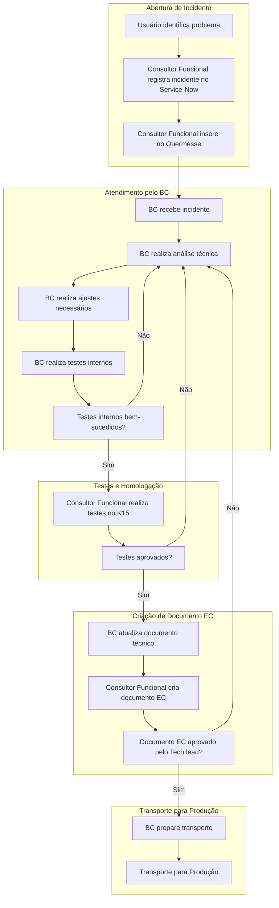
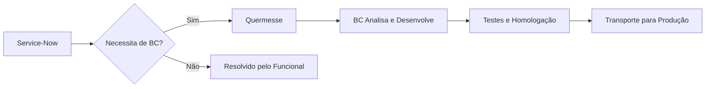

# Quermesse

> 🗘 Este documento, assim como o negócio, está em constante fase de melhoria e adaptação.

## Menu
1. [Introdução](#introdução)
2. [Glossário](#glossário)
3. [O que é Quermesse?](#o-que-é-quermesse)
   - [Visão geral](#visão-geral)
   - [Como funciona?](#como-funciona)
   - [Transação e filtro](#transação-e-filtro)
4. [Boas práticas](#boas-práticas)
5. [Atividades iniciais](#atividades-iniciais)
6. [Fluxo Completo](#fluxo-completo)
7. [Fluxo de atendimento por Status](#fluxo-de-atendimento-por-status)
   - [Status de Incidentes](#status-de-incidentes)
   - [Diagrama de fluxo](#diagrama-de-fluxo)

## Fluxo Completo

---

## Introdução

A **EDP JUMP GA** é uma área da EDP responsável pela gestão de ativos e processos relacionados ao setor elétrico. O time de **Business Consulting (BC)** atua no desenvolvimento e manutenção de soluções SAP para suportar as operações da empresa, garantindo eficiência e conformidade com os padrões técnicos e regulatórios.

## Glossário

É bem comum a utilização de siglas e aqui temos algumas para facilitar o entendimento dos processos/fluxos que são abordados para atendimentos de INC. A descrição abaixo é uma representação particular do cenário abordado e não contempla os termos de forma abrangente e/ou aplicada em outros cenários / times / escopos.

| Sigla | Significado | Descrição |
| :--- | :---------- | :------------ |
| AST | Asset | Abreviação para centralizador de âmbito evolutivo |
| BC|Business Consulting | ~~Find Clarity in Chaos~~ ABAP, Desenvolvedor SAP, Consultor ABAP, SAP DEV|
| CD | Change request | Documento de modificação criado no ChaRM |
| ChaRM | Change Management | Componente do sistema SAP que gerencia e controla o processo de solicitações de mudança em um ambiente SAP |
| DFCT | Corrective Change | Refere-se a mudanças corretivas aplicadas a um incidente já em andamento |
| FF | Firefighter | Perfil para acesso em Ambiente Produtivo com finalidades de análise e processamento |
| GA|Gestão de Ativos| Área responsável pela gestão de ativos na EDP |
| INC|Incidentes| Abreviação para centralizador de âmbito corretivo |
| TCODE |Transação SAP | _Transaction code_ de forma abreviada |
| Service-Now |Sistema de serviços EDP | Sistema interno da EDP usado para gestão de ticket/chamados |

## Quermesse

### Visão geral
O Quermesse atua como uma ponte entre o Service-Now e o time de BC. Quando um incidente é criado no Service-Now, o consultor funcional avalia se é necessário o envolvimento do time técnico. Caso positivo, o incidente é inserido no Quermesse, onde o BC pode gerenciar o fluxo de trabalho, desde a análise até a resolução.

### Como funciona

Quermesse é um sistema criado e mantido pelo time de `BC` da **EDP JUMP GA** que tem como finalidade gerir os *Incidentes* que foram criados no sistema Service-Now e que exigem a atuação do time de `BC` para análises, melhorias e outros.

**--> TODO** Incluir exemplo visual do sistema Quermesse ou expandir detalhes sobre como ele se integra ao Service-Now.

### Transação e filtro

Para acessar a solução, deve-se usar a tcode `ZCA_QUERMESSE_BC`. Uma transação (ou TCODE) é um código utilizado no sistema SAP para executar uma função ou acessar uma aplicação específica. No Quermesse, essa transação permite filtrar por Status, `BC` responsável, tickets abertos e outros. Por padrão, o filtro inicial lista itens sem `BC` atribuído e que estão em aberto, facilitando a identificação de demandas disponíveis.

## Boas práticas

Para garantir que o fluxo ocorra como esperado, algumas regras devem ser seguidas durante os atendimentos:

- INC deve estar corretamente inserido na Quermesse antes do início de desenvolvimento/análise
- O recurso funcional insere o INC na Quermesse e o recurso `BC` deve atualizá-lo
- O status do INC deve ser atualizado conforme a evolução do atendimento
- O campo Resolução da Corretiva deve ser atualizado conforme a solução avança (análise/testes/etc.)
- Após o ajuste ser transportado para o _Ambiente de Produção_, o item deve ser fechado na Quermesse

**--> TODO** Adicionar mais contexto ou exemplos práticos de como essas boas práticas são aplicadas.

---

### Boas práticas para atendimento de incidentes
- **Inserção correta no Quermesse:** Antes de iniciar qualquer análise ou desenvolvimento, verifique se o INC foi corretamente inserido no Quermesse. Isso garante que o item seja rastreado e priorizado adequadamente.
  - Exemplo: Um INC criado no Service-Now com o título "Erro na fatura XYZ" deve ser inserido no Quermesse com o mesmo título e com todos os campos obrigatórios preenchidos.
- **Atualização de status:** Mantenha o status do INC atualizado conforme o progresso do atendimento. Isso permite que toda a equipe tenha visibilidade do andamento.
  - Exemplo: Ao iniciar a análise técnica, altere o status para "Em Análise". Após a conclusão dos testes, atualize para "Aguardando Homologação".
- **Resolução da Corretiva:** Descreva de forma clara e detalhada a solução aplicada no campo "Resolução da Corretiva". Isso facilita a revisão e a homologação pelo consultor funcional.
  - Exemplo: "Corrigido erro na rotina de cálculo de impostos. Ajustada a tabela ZIMPOSTOS para incluir novos códigos fiscais."
- **Fechamento do INC:** Após o transporte para produção, certifique-se de que o INC seja fechado no Quermesse. Isso encerra o ciclo de atendimento e evita duplicidade de esforços.
