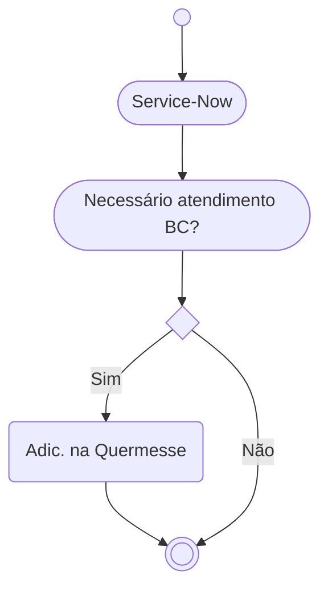
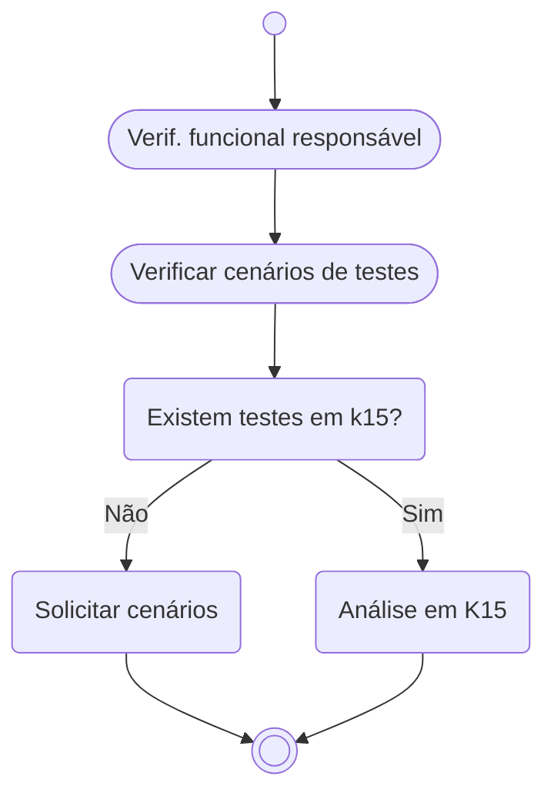
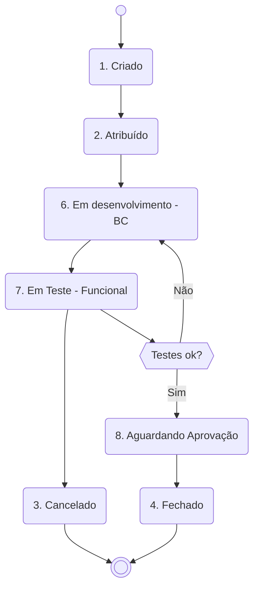

## Introdução
Este documento tem como objetivo explicar de maneira direta como são os fluxos e processos no atendimento de *Incidentes* pelo time de `BC` da **EDP JUMP GA**.

**--> TODO** Incluir uma breve explicação sobre a **EDP JUMP GA**, para contextualizar o leitor sobre o que é e qual sua função.

## Glossário
É bem comum a utilização de siglas e aqui temos algumas para facilitar o entendimento dos processos/fluxos que são abordados para atendimentos de INC. A descrição abaixo é uma representação particular do cenário abordado e não contempla os termos de forma abrangente e/ou aplicada em outros cenários / times / escopos.

| Sigla | Significado | Descrição |
| :--- | :---------- | :------------ |
| AST | Asset | Abreviação para centralizador de âmbito evolutivo |
| BC|Business Consulting | ~~Find Clarity in Chaos~~ ABAP, Desenvolvedor SAP, Consultor ABAP, SAP DEV|
| DFCT | Corrective Change | Refere-se a mudanças corretivas aplicadas a um incidente já em andamento |
| FF | Firefighter | Perfil para acesso em Ambiente Produtivo com finalidades de análise e processamento |
| GA|Gestão de Ativos| Área responsável pela gestão de ativos na EDP |
| INC|Incidentes| Abreviação para centralizador de âmbito corretivo |
| TCODE |Transação SAP | _Transaction code_ de forma abreviada |
| Service-Now |Sistema de serviços EDP | Sistema interno da EDP usado para gestão de ticket/chamados |

## O que é Quermesse?
Quermesse é um sistema criado e mantido pelo time de `BC` da **EDP JUMP GA** que tem como finalidade gerir os *Incidentes* que foram criados no sistema Service-Now e que exigem a atuação do time de `BC` para análises, melhorias e outros.

**--> TODO** Incluir exemplo visual do sistema Quermesse ou expandir detalhes sobre como ele se integra ao Service-Now.

## Transação e filtro
Para acessar a solução, deve-se usar a tcode `ZCA_QUERMESSE_BC`. Uma transação (ou TCODE) é um código utilizado no sistema SAP para executar uma função ou acessar uma aplicação específica. No Quermesse, essa transação permite filtrar por Status, `BC` responsável, tickets abertos e outros. Por padrão, o filtro inicial lista itens sem `BC` atribuído e que estão em aberto, facilitando a identificação de demandas disponíveis.

## Visão geral
Itens criados no Service-Now para atendimento do time de Jump GA podem ou não ser adicionados no sistema Quermesse, dependendo da necessidade de apoio técnico. Após análise do recurso funcional (responsável por inserir o item na Quermesse), é definida a inclusão ou não.

## Boas práticas
Para garantir que o fluxo ocorra como esperado, algumas regras devem ser seguidas durante os atendimentos:

- INC deve estar corretamente inserido na Quermesse antes do início de desenvolvimento/análise
- O recurso funcional insere o INC na Quermesse e o recurso `BC` deve atualizá-lo
- O status do INC deve ser atualizado conforme a evolução do atendimento
- O campo Resolução da Corretiva deve ser atualizado conforme a solução avança (análise/testes/etc.)
- Após o ajuste ser transportado para o _Ambiente de Produção_, o item deve ser fechado na Quermesse

**--> TODO** Adicionar mais contexto ou exemplos práticos de como essas boas práticas são aplicadas.

## Atividades iniciais
Para evitar retrabalho e garantir que o INC seja escalável, é necessário que os dados estejam organizados para que o `BC` possa iniciar o atendimento. Os dados de testes anexados são essenciais para garantir soluções mais assertivas.

> O atendimento do INC é iniciado **somente após os dados de testes serem anexados**. A premissa de dados está diretamente ligada à qualidade da entrega da solução.

Para ajudar a criar um arquivo de testes, você pode responder às seguintes perguntas:

0. Qual Ambiente?
1. Quais são os passos de execução?
2. Qual o resultado encontrado hoje?
3. Qual o resultado esperado e como verificar?

## Fluxo de atendimento por Status
Esta seção representa os diferentes Status dos Incidentes mantidos na Quermesse.

### Status de Incidentes
| Status | Descrição | Observações | 
| :---------- | :---------- | :---------- | 
| Criado | Item foi criado na Quermesse | Este passo será mantido até que os dados de testes sejam anexados/compartilhados | 
| Atribuído | O item foi direcionado para atendimento | ∆ Atendimento ainda não iniciado |
| * Em desenvolvimento (BC) | O item está sendo atendido pelo `BC` | - | 
| * Em Teste (Funcional) | A solução proposta está em testes funcionais | - | 
| * Aguardando Aprovação | Aguardando aprovação do DFCT | Acontece após o sucesso dos testes funcionais | 
| ~~Case SAP criado~~ | ~~Solução sendo atendida por _Case SAP_~~ |  
| Reaberto | Aberto novamente por necessidade de melhoria/ajuste | - | 
| Cancelado | Não há mais necessidade de ajuste ABAP | - | 
| Fechado | Concluído análise/ajuste | Última fase do INC |

*_Itens que devem ser criados. Ainda não existentes no cenário atual_*

### Diagrama de fluxo

**--> TODO** Considerar adicionar uma legenda para os diagramas, explicando os símbolos e a lógica de decisão utilizada.
